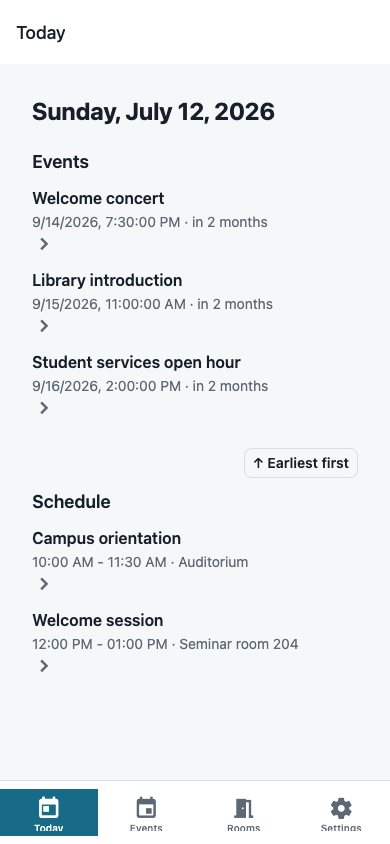
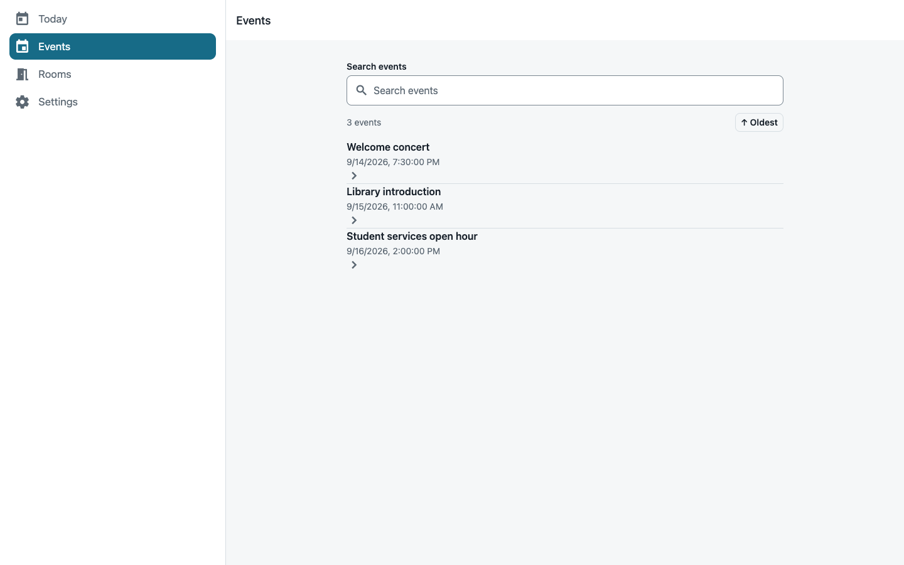
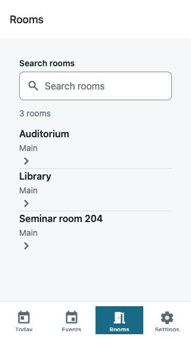
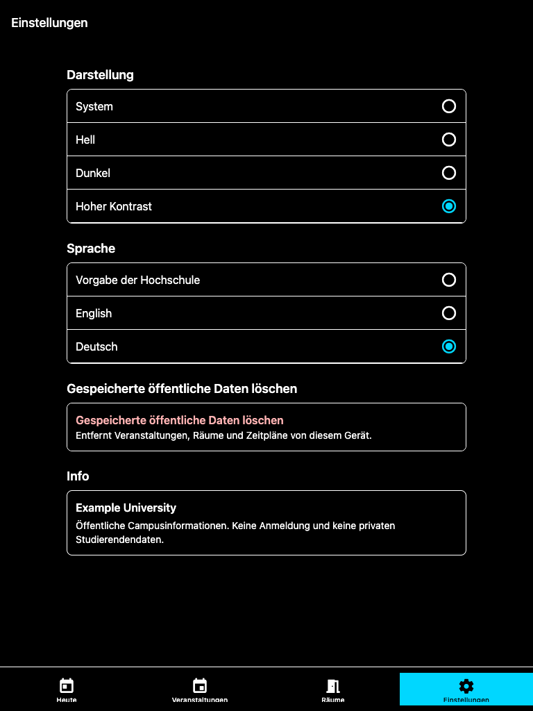

# Campus App Kit

[](https://github.com/sebastianspicker/campus-app-kit/actions/workflows/ci.yml)
[](LICENSE)
[](.nvmrc)
[](package.json)

A public, privacy-safe starter for building a university campus app with **React Native + Expo** and an optional **Backend-for-Frontend (BFF)**.

---

## Quick Start

```bash
# Install dependencies
pnpm install --frozen-lockfile

# Configure the mobile app's BFF URL
cp apps/mobile/.env.example apps/mobile/.env

# Start BFF and mobile in parallel
INSTITUTION_ID=hfmt pnpm dev
```

Then open the mobile app with a dev client. For a physical device, edit
`apps/mobile/.env` so `EXPO_PUBLIC_BFF_BASE_URL` points to the BFF URL reachable
from that device.

For Expo Go, run `pnpm --filter @campus/mobile start` instead of `pnpm dev`.

**Prerequisites:** Node.js 22.13 or newer, pnpm 9. See [Runbook](docs/runbook.md) for detailed setup.

---

## Features

- **Mobile app** – Expo SDK 57 with Expo Router; responsive Today, Events, Rooms, Settings, and public detail screens
- **BFF** – Optional Node.js API with public connectors, rate limiting, HTTP caching, CORS, circuit breaker
- **Institution packs** – Public config per institution; easy to add more
- **Shared types** – Zod schemas used by both BFF and mobile

## Campus Desk screenshots (deterministic public data)

| Today on mobile | Events on desktop |
|---|---|
|  |  |

| Rooms on small mobile | Settings in German high contrast |
|---|---|
|  |  |

---

## Project Structure

```
apps/
  mobile/         Expo React Native app (Expo Router)
  bff/            Optional BFF API (public connectors + private stubs)
packages/
  shared/         Domain types + Zod schemas
  institutions/   Public institution packs
docs/             Architecture, runbook, CI, deployment
```

Internal planning, audit, ledger, status, and deprecated-doc packets are not
part of the public docs surface. Keep them in the ignored local `archive/` lane
or in a private fork.

## How to Read This Repo

Start with the runtime path, then branch out:

1. Mobile screens in `apps/mobile/app/` call hooks in `apps/mobile/src/hooks/`.
2. Hooks call `apps/mobile/src/data/publicApi.ts`, which validates BFF responses with schemas from `@campus/shared`.
3. The BFF entry point is `apps/bff/src/server.ts`; data routes live in `apps/bff/src/routes/`.
4. Routes call public connectors in `apps/bff/src/connectors/public/` and load public institution packs from `packages/institutions/src/packs/`.
5. `packages/shared/src/domain/` is the contract between BFF and mobile. Update schemas there before changing response shapes.

Private integrations should implement the stubs under `apps/bff/src/connectors/private-stubs/` in a private fork. This public repo should keep only public sources, public institution metadata, and mock fixtures.

See [Architecture](docs/architecture.md) for data flow diagrams and design decisions.

---

## Configuration

| Context | Required Variables |
|--------|---------------------|
| **BFF** | `INSTITUTION_ID` (e.g., `hfmt`) |
| **Mobile runtime** | `EXPO_PUBLIC_BFF_BASE_URL` |
| **Mobile preview/production build** | `INSTITUTION_ID`, `EXPO_PUBLIC_BFF_BASE_URL` |

Additional options: `BFF_PORT`, `CORS_ORIGINS`, `BFF_TRUST_PROXY`. See [Runbook → Configuration](docs/runbook.md#configuration) for full details.

---

## Development Commands

| Command | Description |
|--------|-------------|
| `pnpm dev` | Run BFF + mobile in parallel |
| `pnpm verify` | Full CI check (install, lint, typecheck, tests, build, browser/BFF E2E, marker scan) |
| `pnpm lint` | Lint all packages |
| `pnpm typecheck` | TypeScript check |
| `pnpm test` | Run tests |
| `pnpm test:e2e` | Run deterministic BFF HTTP E2E tests |
| `pnpm test:web` | Export the Expo web app and run Playwright/axe checks |
| `pnpm build` | Build all packages |

---

## E2E Tests

The default E2E gate is process-level and starts the real compiled BFF on a
temporary local port with `INSTITUTION_ID=mockuni` and `PUBLIC_EVENTS_MODE=mock`.
It covers the public HTTP flows consumed by the mobile app: health, events,
rooms, schedule, today, and invalid query handling.

```bash
pnpm install --frozen-lockfile
pnpm test:e2e
```

Native mobile E2E tests use Detox under `apps/mobile/e2e/`. They require
generated native iOS or Android projects and simulator/emulator tooling, so they
are separate from the clean-checkout default gate.

---

## Documentation

- [Product context](PRODUCT.md)
- [Campus Desk design system](DESIGN.md)
- [Frontend conventions and release checks](docs/frontend.md)

| Doc | Description |
|-----|-------------|
| [Runbook](docs/runbook.md) | Setup, config, commands, troubleshooting |
| [Architecture](docs/architecture.md) | Design overview and diagrams |
| [Connectors](docs/connectors.md) | BFF connectors and stubs |
| [Institutions](docs/institutions.md) | Institution pack configuration |
| [Deploy](docs/deploy/) | Deployment guides (BFF, mobile) |
| [FAQ](docs/faq.md) | Frequently asked questions |

---

## Status

- **Version:** 1.1.0
- **Public scope:** Expo mobile starter, optional Node BFF, public connectors,
  public institution packs, shared schemas, and mock fixtures
- **Private scope:** secrets, SSO, private endpoints, private connectors,
  internal planning/status ledgers, and deprecated audit packets
- **Changelog:** See [CHANGELOG.md](CHANGELOG.md)

---

## Troubleshooting

| Symptom | Typical Cause | Fix |
|--------|---------------|-----|
| Generic 500 on data routes | Connector or Zod throw | Check BFF logs for details |
| BFF fails at startup | Missing `INSTITUTION_ID` | Set `INSTITUTION_ID=hfmt` |
| Mobile "Missing BFF base URL" | Wrong env variable | Set `EXPO_PUBLIC_BFF_BASE_URL` |
| Empty events/rooms/schedule | Missing config or upstream failure | Check `publicSources` / `publicRooms` |
| Rate limit issues | trustProxy / forwarded headers | See runbook for proxy setup |
| Events/schedule wrong time | Timezone/date parsing | ICS TZID and German dates are parsed as local time; check server timezone |

---

## Security & Privacy

- No secrets or private endpoints in this repo
- Public connectors only; private connectors belong in a separate (private) repo
- See [SECURITY.md](SECURITY.md) and [Threat Model](docs/threat-model-lite.md)

---

## Contributing

Contributions welcome. Please read [CONTRIBUTING.md](CONTRIBUTING.md) and run `pnpm verify` before opening a PR.

---

## License

MIT. See [LICENSE](LICENSE).
