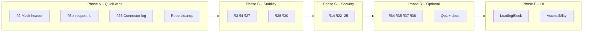

# Open Improvements and Implementation Plan

Status after completed phases (BFF fixes, route factory, mobile data layer, UI deduplication, building-native-ui, expo-api-routes, expo-tailwind-setup, vercel-react-native-skills). This document bundles **remaining** items and prioritized implementation.

---

## 1. Completed (Reference)

- **BFF critical:** §13 (handler try/catch), §15 (ICS date), §16 (Forwarded IPv6), §17 (sendError res.end), §18 (URL try/catch), §19 (PUBLIC_EVENTS_DATE), §20 (safeResolveUrl), §21 (institution by path)
- **BFF structure:** createJsonRoute, route map, route-level error handling (§1/§9)
- **Config/docs:** §6 (BFF README INSTITUTION_ID), §7 (MOBILE_PUBLIC_BFF_URL deprecate), §8 (verify rg exclusions), §12 (empty-response docs)
- **BFF further:** §29 (cache evict on read), §31 (fetchWithTimeout signal), §10 (health Cache-Control: no-store), §32 (logger case-insensitive + recursive)
- **Mobile:** §33 (getCachedJson, cache key with context, Zod catch), path aliases, ResourceListSection/ResourceDetailScreen, ResourceListItem memo + useCallback, VirtualizedList → FlashList
- **UI/Skills:** Screen without SafeAreaView, contentInsetAdjustmentBehavior, Text selectable, borderCurve, theme EXPO_OS; Expo API Routes; Tailwind v4 + NativeWind; FlashList + stable callbacks

---

## 2. Repo Cleanup (Done)

| Task | Details |
|------|---------|
| **Scripts** | `docs/ci.md` contains scripts table: verify-production-ready.sh, ci-local.sh, build.sh, generate-lockfile.sh. |
| **Fixtures** | `apps/bff/src/__fixtures__/`: All 8 files are used by tests; no change. |
| **BUGS_AND_FIXES** | §2, §5, §26 marked done; quick reference remains linkable. |

---

## 3. Documentation Cleanup

| Task | Details |
|------|---------|
| **Runbook vs README** | Reduce duplicate env/quickstart content; single source (e.g. “see Runbook”) with links. |
| **Redundant lists** | Document env vars in one place; others reference it. |
| **No removal** | Keep CONTRIBUTING, SECURITY, CODE_OF_CONDUCT, ISSUE_TEMPLATE, PULL_REQUEST_TEMPLATE. |

---

## 4. Remaining Code Improvements (BUGS_AND_FIXES)

### High priority (quick wins)

| # | Summary | Implementation |
|---|---------|----------------|
| **§2** | Mock mode signal | With `PUBLIC_EVENTS_MODE=mock`: response header (e.g. `x-data-mode: mock`) or `_meta.mocked: true` in JSON. |
| **§5** | x-request-id and cache | Set `x-request-id` only on cache miss or not in sendJsonWithCache; in server.ts only for non-cacheable responses. |
| **§26** | Connector errors visible | In events/schedule connectors: log per-source failures; optional header/flag `x-data-degraded: true` or `_meta.partial: true` on fallback. |
| **§36** | No err.message to client | Use generic messages only; ensure no `err.message` is sent to client; log everything server-side. |

### Medium priority (stability / ops)

| # | Summary | Implementation |
|---|---------|----------------|
| **§3** | Empty data vs missing config | Optional: different status or `_meta.sourcesConfigured: false` when publicSources/publicRooms missing/empty; at least docs/log. |
| **§4** | /today semantics | Either date filtering or rename endpoint + docs (“aggregate home view”). |
| **§27** | Stable event IDs | buildEventId with date from page/event, not `new Date()`; “now” only as fallback + document. |
| **§28** | ICS TZID + invalid dates | Respect TZID where possible; skip or flag invalid dates instead of 1970. |
| **§30** | Cache in-flight timeout | Loader or in-flight promise with timeout; on timeout remove entry, optionally retry. |

### Security / rate limit

| # | Summary | Implementation |
|---|---------|----------------|
| **§14** | Rate limit before method check | Rate-limit all requests (including wrong methods); then 405. |
| **§23** | Validate client key | Validate Forwarded/X-Forwarded-For as valid IPv4/IPv6; fallback to remoteAddress if invalid. |
| **§24** | Rate-limit map cap | Cap map size (e.g. LRU) or periodic cleanup; optionally Redis. |
| **§25** | Rate-limit OPTIONS | Include OPTIONS in rate limit; optionally 404 for unknown paths. |
| **§22** | Document trustProxy | Docs for “auto” and deployment; optional explicit env option. |

### Optional / extensions

| # | Summary | Implementation |
|---|---------|----------------|
| **§34** | Auth guard | Optional guard in root layout for private forks; redirect to login when session missing; docs. |
| **§35** | Demo session marker | `Session` → `DemoSession` or `isDemo: true`; JSDoc “template only”. |
| **§37** | BFF integration tests | Supertest (or similar): 404, 405, 429, institution error, one successful route. |
| **§38** | Stub signals | Private stubs e.g. `{ stub: true, data: [] }` or clear docs. |

---

## 5. Code Deduplication (Open)

| Area | Status | Open |
|------|--------|------|
| BFF routes | Done (createJsonRoute) | – |
| Mobile publicApi / hooks | Done (getCachedJson, cache key) | – |
| UI list/detail | Done (ResourceListSection, ResourceDetailScreen) | – |
| **BFF vs mobile cache** | Two getCached implementations | Document as intentional or small shared cache package if useful. |
| **Dead exports** | getJsonResponse removed | `CampusLabel` (shared), `PublicRoomsSchema` (publicRooms), `KnownInstitutionId` (institutions) currently unused; optionally remove or keep as public API. |

---

## 6. Refactoring (Open)

- **Shared room types:** Single source of truth (`public.ts` vs `publicRooms.ts`); optionally export from one only.
- **Kebab-case UI filenames:** Optional gradual rename (e.g. `Card.tsx` → `card.tsx` in `src/ui`; update Metro/imports).

---

## 7. QoL Improvements (Open)

- **Quick-start one-liner:** One command for BFF + mobile (e.g. `INSTITUTION_ID=hfmt pnpm dev`) in README/Runbook.
- **Health optional:** Dependency check (e.g. institution pack loadable) and/or response schema for `/health`.
- **.env.example:** Consistent per app; all variables with short comment.

---

## 8. Possible New Features

- Auth guard for private forks (§34).
- Clear demo-session marker (§35).
- Stub responses with tag (§38).
- /today with real date filtering or clear docs (§4).
- BFF integration tests (§37).

---

## 9. UI Improvements (Partly Done)

- **Loading/Empty:** Done: `LoadingBlock` and `EmptyState` in `src/ui`, used in ResourceListSection and ResourceDetailScreen.
- **Consistency:** All lists/details already use ResourceListSection/ResourceDetailScreen and theme.
- **Accessibility:** ResourceListItem has accessibilityRole and accessibilityLabel; login button updated; further checks optional.
- **boxShadow:** For new shadows use only `boxShadow` (not shadowColor/elevation).
- **Kebab-case UI filenames:** Optional, gradual (e.g. Card.tsx → card.tsx).

---

## 10. Implementation Plan (Phases)

### Phase A – Quick wins (1–2 days)

1. **§2** Mock-mode header or `_meta.mocked`.
2. **§5** x-request-id only on cache miss or not for cacheable responses.
3. **§26** Log connector failures; optional `_meta.partial`/header.
4. **Repo cleanup:** Review scripts/fixtures; align BUGS_AND_FIXES.

### Phase B – Stability & semantics (2–3 days)

5. **§3** Empty data vs config (status/flag or docs).
6. **§4** /today: filtering or rename + docs.
7. **§27** Stable event IDs.
8. **§28** ICS TZID + invalid date handling.
9. **§30** Cache in-flight timeout.

### Phase C – Rate limit & security (2–3 days)

10. **§14** Rate limit before method check.
11. **§23** IP validation for client key.
12. **§24** Rate-limit map cap/cleanup.
13. **§25** Rate-limit OPTIONS.
14. **§22** Document trustProxy.

### Phase D – Optional & extensions

15. **§34** Optional auth guard + docs.
16. **§35** Demo-session type/JSDoc.
17. **§37** BFF integration tests (supertest).
18. **§38** Stub signals or docs.
19. **QoL:** Quick-start, health optional, .env.example.
20. **Docs:** Runbook/README cleanup; dead exports.

### Phase E – UI polish (optional)

21. LoadingBlock/EmptyState.
22. Accessibility check.
23. Kebab-case UI filenames (optional).

---

## 11. Quick Reference: Key Files

| Area | Files |
|------|-------|
| BFF server/routes | `apps/bff/src/server.ts`, `apps/bff/src/routes/`, `apps/bff/src/routes/createJsonRoute.ts` |
| BFF cache/HTTP | `apps/bff/src/utils/cache.ts`, `apps/bff/src/utils/httpCache.ts` |
| BFF connectors | `apps/bff/src/connectors/public/` (hfmtWebEvents, publicSchedule, icsParser) |
| BFF rate limit | `apps/bff/src/utils/rateLimit.ts`, `apps/bff/src/utils/clientKey.ts` |
| Mobile data | `apps/mobile/src/data/publicApi.ts`, `apps/mobile/src/data/cache.ts` |
| Mobile UI | `apps/mobile/src/ui/` (Screen, Card, ResourceListSection, ResourceDetailScreen, ResourceListItem) |
| Shared | `packages/shared/src/` |
| Docs | `README.md`, `docs/runbook.md`, `BUGS_AND_FIXES.md` |
| Verify | `scripts/verify-production-ready.sh` |

---

This plan can be worked through step by step; phases A–C deliver the most benefit for stability, ops, and security.
