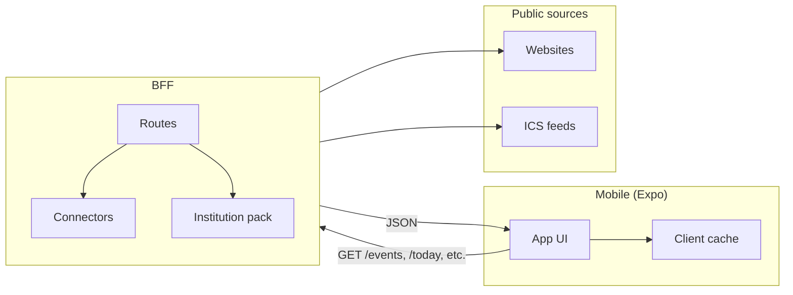
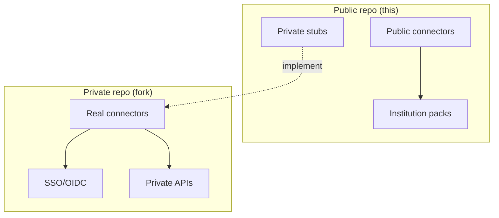
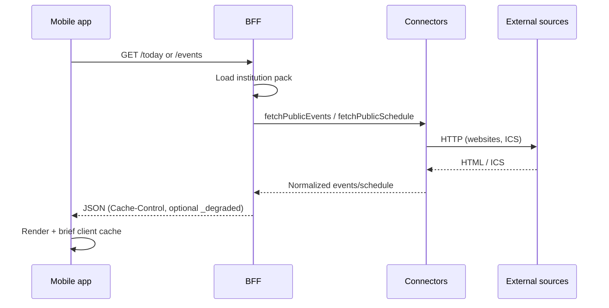

# Architecture

This repo ships a public Campus App template with a small BFF (backend-for-frontend). The BFF exposes only public data sources and stubbed connectors.

## High-level overview

## Why a BFF

- Shield the app from scraping logic and rate limits.
- Normalize data into a shared domain model.
- Keep sensitive connectors out of the public repo.

## Core pieces

- **Mobile app** – Expo + Expo Router (tabs, events, rooms, schedule).
- **BFF** – Public connectors + private stubs; rate limiting, caching, CORS.
- **Shared** – Domain types and Zod schemas (`packages/shared`).
- **Institution packs** – Public data only (`packages/institutions`).

## Public vs private

| In this repo | In a private fork |
|--------------|-------------------|
| Public website / ICS data | Real connectors (SSO, sessions, scraping) |
| Institution packs (public info only) | Private endpoints and ops |
| Interfaces and stubs for private connectors | Caching, rate limits, monitoring |

## Data flow

1. Mobile app requests `/today` or `/events` (or `/rooms`, `/schedule`) from the BFF.
2. BFF reads the institution pack and calls public connectors.
3. Responses are normalized into shared domain models (Zod-validated).
4. Mobile app renders the data and caches briefly (e.g. `getCachedJson`).

## Key files

| Layer | Location |
|-------|----------|
| BFF server | `apps/bff/src/server.ts`, `apps/bff/src/routes/` |
| BFF connectors | `apps/bff/src/connectors/public/`, `.../private-stubs/` |
| Shared schemas | `packages/shared/src/domain/` |
| Institution packs | `packages/institutions/src/packs/` |
| Mobile data | `apps/mobile/src/data/publicApi.ts`, `.../cache.ts` |
| Mobile UI | `apps/mobile/src/ui/`, `apps/mobile/app/` |
