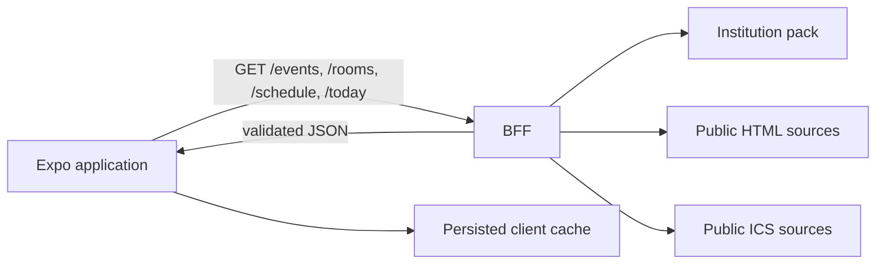

# Architecture

Concourse separates public source ingestion from presentation. The Expo client
uses normalized JSON from the BFF. Both layers validate the same schemas from
`@concourse/shared`.

```mermaid
flowchart LR
  Client["Expo application"] -->|"GET /events, /rooms, /schedule, /today"| BFF
  BFF --> Pack["Institution pack"]
  BFF --> HTML["Public HTML sources"]
  BFF --> ICS["Public ICS sources"]
  BFF -->|"validated JSON"| Client
  Client --> Cache["Persisted client cache"]
```

## Components

| Component | Responsibility |
|---|---|
| `apps/mobile` | Expo Router application, local preferences, persisted public-data cache, and UI state |
| `apps/bff` | HTTP boundary, institution loading, public-source normalization, cache policy, and operational controls |
| `packages/shared` | Zod schemas, public domain types, errors, abort helpers, and timezone utilities |
| `packages/institutions` | Schema-validated public institution packs |

## Request flow

1. A mobile data hook requests a BFF route through
   `apps/mobile/src/data/publicApi.ts`.
2. The BFF applies request IDs, security headers, CORS, rate limiting, method
   checks, and optional bearer auth.
3. The BFF loads the pack selected by `INSTITUTION_ID`.
4. A route reads pack data or calls a public connector.
5. The route validates its response against a shared Zod schema.
6. The client validates the response again and updates its persisted cache.

Superseded client requests are aborted. Cached data remains available during
offline or degraded operation and is labeled by the UI.

## Runtime contracts

- Unknown institution IDs fail instead of selecting a fallback pack.
- Data routes with no configured source return `404 not_found`.
- Events and schedules may return partial results with `_degraded: true`.
- Degraded BFF responses are not cached.
- Dates from public sources are normalized as ISO timestamps with offsets.
- Campus-local date handling uses the pack timezone, or `Europe/Berlin` when a
  pack omits it.
- Data responses identify the selected pack with `x-institution-id`.
- Every response includes `x-request-id`.

## Public and private boundaries

This repository contains public source URLs, public campus metadata, sanitized
static-demo records, and interfaces for private extensions. Files under
`apps/bff/src/connectors/private-stubs/` are not wired into the public runtime.

Protected systems, credentials, session handling, SSO, private schedules, and
student data belong in a separately reviewed private implementation. Do not add
them to an institution pack or static-demo record.

## Expo server route

`apps/mobile/app/api/health+api.ts` defines `GET /api/health` for the Expo server
runtime. It is separate from the BFF `GET /health` endpoint and does not serve
campus data.

## Key paths

| Area | Path |
|---|---|
| BFF listener | `apps/bff/src/server.ts` |
| BFF routes | `apps/bff/src/routes/` |
| Public connectors | `apps/bff/src/connectors/public/` |
| Private extension stubs | `apps/bff/src/connectors/private-stubs/` |
| Mobile routes | `apps/mobile/app/` |
| Mobile data layer | `apps/mobile/src/data/`, `apps/mobile/src/hooks/` |
| Shared public contract | `packages/shared/src/domain/public.ts` |
| Institution registry | `packages/institutions/src/packs.ts` |
