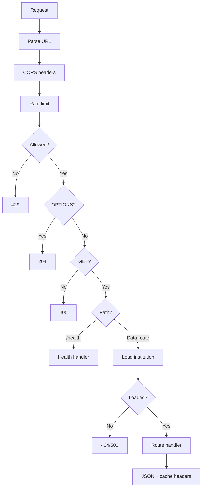

# RUNBOOK

## Prerequisites

- Node.js 20 (see `.nvmrc`)
- pnpm 9 (see `package.json#packageManager`)
- Expo Go or a dev client for mobile testing (optional)

## Install

```bash
pnpm install --frozen-lockfile
```

## Local development

Run the BFF (public API):

```bash
INSTITUTION_ID=hfmt pnpm --filter @campus/bff dev
```

Run the mobile app:

```bash
pnpm --filter @campus/mobile start
```

Run the mobile app with a dev client:

```bash
pnpm --filter @campus/mobile dev
```

## Configuration

BFF:
- `INSTITUTION_ID` (required; available ids live in `packages/institutions/src/packs/`)
- `BFF_PORT` (optional; default `4000`)
- `CORS_ORIGINS` (optional; comma-separated; use `*` for development)
- `BFF_TRUST_PROXY` (optional; default `auto`). Controls whether the BFF uses `X-Forwarded-For` / `Forwarded` for the client IP (rate limiting, logs). **`auto`**: trust forwarded headers only when the direct peer is private/loopback (e.g. reverse proxy on same host). **`always`**: always use forwarded client IP (use only when the BFF is strictly behind a trusted proxy that sets these headers). **`never`**: ignore forwarded headers; use `socket.remoteAddress` only. Forwarded values are validated as IPv4/IPv6; invalid values fall back to the direct peer address.

Mobile:
- `EXPO_PUBLIC_BFF_BASE_URL` (required for production builds; defaults to `http://localhost:4000` in development)

See root and app-level `.env.example` files for a concise list of variables.

## Format and lint

Formatting is enforced via ESLint (no separate formatter configured).

```bash
pnpm lint
```

## Typecheck

```bash
pnpm typecheck
```

## Build

```bash
pnpm build
```

## Tests

```bash
pnpm test
```

## Verification (full loop)

```bash
pnpm verify
```

`pnpm verify` runs install, lint, typecheck, tests, build, and a placeholder-marker scan.

## Security checks (minimum baseline)

Secret scan (local, if `gitleaks` is installed):

```bash
gitleaks detect --config .gitleaks.toml
```

SAST (CI-only):
- GitHub Actions runs CodeQL in `.github/workflows/codeql.yml`.

SCA / dependency review:
- GitHub Actions runs dependency review in `.github/workflows/dependency-review.yml`.
- Optional local audit (uses the npm registry):

```bash
pnpm audit --prod
```

## Quick start (one command)

From repo root, with one terminal:

```bash
INSTITUTION_ID=hfmt pnpm dev
```

This runs BFF and mobile in parallel. For BFF only: `INSTITUTION_ID=hfmt pnpm --filter @campus/bff dev`. For mobile only: `pnpm --filter @campus/mobile start`.

## Auth (optional, for private forks)

The template has no route-level auth; tabs are reachable without logging in. For a private fork that requires login: add a guard in the root layout (or a wrapper) that checks for a real session and redirects to the login screen when missing. The demo session (`getDemoSession()`, `isDemo: true`) is for template use only; replace with real auth.

## Fast loop

Use this for quick local checks during development:

```bash
pnpm lint
pnpm typecheck
```

## Health endpoint

`GET /health` returns `200 { status: "ok" }` with `Cache-Control: no-store`. It is a liveness probe only; it does not check institution pack or upstream connectors. Optional: add a dependency check or response schema in a fork.

## BFF endpoints (semantics)

- **GET /events** – Public events from configured sources (see connectors).
- **GET /today** – Aggregate home view: same events as `/events` plus `rooms`. Not filtered by the current calendar day; use for a combined “home” payload. For date-scoped behaviour, filter client-side or use `/events`.
- **GET /rooms**, **GET /schedule** – Rooms and schedule from institution config.

Responses may include optional `_sourcesConfigured: false` when no sources are configured; `_degraded: true` / header `x-data-degraded` when data is partial or fallback. Event IDs are derived from URL + title + date; when the source page has no date, the BFF uses a server-time fallback and IDs can change across requests.

### BFF request flow



## Empty or missing data

If `/events`, `/rooms`, or `/schedule` return 200 with empty arrays, check:

- **BFF:** `publicSources.events`, `publicSources.schedules`, and `publicRooms` in the institution pack (e.g. `packages/institutions/src/packs/*.ts` and `apps/bff/src/config/institutions/*.json`). Missing or empty config yields empty data.
- **Environment:** `INSTITUTION_ID` must match a pack that defines those sources.
- **Upstream:** Public connectors fetch from external URLs; if those fail, the BFF may return partial or empty data. Check BFF logs for fetch/parse errors.

See also the quick reference in `BUGS_AND_FIXES.md` (root).

## Troubleshooting

- If the mobile app cannot reach the BFF, set `EXPO_PUBLIC_BFF_BASE_URL` to the BFF URL.
- If `pnpm` fails due to lockfile drift, re-run `pnpm install --frozen-lockfile` from the repo root.
- If TypeScript builds fail, ensure each package is built in dependency order by running `pnpm build` from the repo root.
- To skip install or the TODO/FIXME marker scan during verify: `SKIP_INSTALL=1 pnpm verify` or `SKIP_MARKER_CHECK=1 pnpm verify`.
