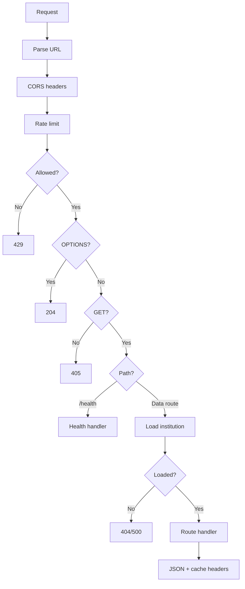

# RUNBOOK

## Prerequisites

- Node.js 22.13 or newer (see `.nvmrc`)
- pnpm 9 (see `package.json#packageManager`)
- Expo Go or a dev client for mobile testing (optional)

## Install

```bash
pnpm install --frozen-lockfile
```

## Local development

Run the BFF (public API):

```bash
INSTITUTION_ID=hfmt pnpm --filter @campus/bff dev
```

Run the mobile app:

```bash
pnpm --filter @campus/mobile start
```

Run the mobile app with a dev client:

```bash
pnpm --filter @campus/mobile dev
```

## Configuration

BFF:
- `INSTITUTION_ID` (required; available ids live in `packages/institutions/src/packs/`)
- `BFF_PORT` (optional; default `4000`)
- `BFF_REQUIRE_AUTH` (optional; unset/`0`/`false`/`no`/`off` disables bearer auth, `1`/`true`/`yes`/`on` requires it; invalid non-empty values fail closed)
- `BFF_AUTH_TOKEN` (required when `BFF_REQUIRE_AUTH` enables bearer auth; use a long random secret from private infrastructure)
- `CORS_ORIGINS` (optional; comma-separated; use `*` for development)
- `BFF_TRUST_PROXY` (optional; default `never`). Controls which source the BFF uses for the client IP (rate limiting, logs):
  - `never`: ignore forwarded headers; use `socket.remoteAddress` only
  - `auto`: trust `X-Forwarded-For`/`Forwarded` only when the direct peer is a private/loopback address (e.g. a reverse proxy on the same host)
  - `always`: always use the forwarded client IP — only use this when the BFF is behind a trusted proxy

  Forwarded values are ignored by default. When proxy trust is enabled, forwarded values are validated as IPv4/IPv6; invalid values fall back to the direct peer address.

Mobile:
- `EXPO_PUBLIC_BFF_BASE_URL` (required in development and production; set it to the BFF URL reachable from the mobile runtime)
- `INSTITUTION_ID` (required for preview and production builds; local development defaults to the `example` public pack)

See the root `.env.example`, `apps/bff/.env.example`, and `apps/mobile/.env.example` files for concise variable lists.

## Format and lint

Formatting is enforced via ESLint (no separate formatter configured).

```bash
pnpm lint
```

## Typecheck

```bash
pnpm typecheck
```

## Build

```bash
pnpm build
```

## Tests

```bash
pnpm test
```

## Verification (full loop)

```bash
pnpm verify
```

`pnpm verify` runs a frozen dependency install, lint, typecheck, unit and integration tests, build, Playwright/axe web E2E, deterministic BFF E2E, and a placeholder-marker scan.

## Security checks (minimum baseline)

Secret scan (local, if `gitleaks` is installed):

```bash
gitleaks detect --config .gitleaks.toml
```

SAST (CI-only):
- GitHub Actions runs CodeQL in `.github/workflows/codeql.yml`.

SCA / dependency review:
- GitHub Actions runs `pnpm audit --audit-level=moderate --prod` in `.github/workflows/dependency-review.yml`.
- Equivalent local audit (uses the npm registry):

```bash
pnpm audit --audit-level=moderate --prod
```

## Quick start (one command)

From repo root, with one terminal:

```bash
INSTITUTION_ID=hfmt pnpm dev
```

This runs BFF and mobile in parallel. For BFF only: `INSTITUTION_ID=hfmt pnpm --filter @campus/bff dev`. For mobile only: `pnpm --filter @campus/mobile start`.

## Auth (optional, for private forks)

The public template has no mobile login; tabs are reachable without authentication. A private fork that requires login must add a reviewed session provider and route guard. No demo session or placeholder login implementation is included in the public app.

The BFF can enforce a simple bearer-token guard for private fork smoke tests or internal deployments:

```bash
BFF_REQUIRE_AUTH=1
BFF_AUTH_TOKEN=CHANGE_ME_LONG_RANDOM_TOKEN
```

Accepted enabled values are `1`, `true`, `yes`, and `on`. Accepted disabled values are unset, `0`, `false`, `no`, and `off`. Any other non-empty `BFF_REQUIRE_AUTH` value returns `500 auth_misconfigured` instead of serving routes unauthenticated.

## Fast loop

Use this for quick local checks during development:

```bash
pnpm lint
pnpm typecheck
```

## Health endpoint

`GET /health` returns `Cache-Control: no-store` and reports BFF process status,
the selected institution id, uptime, institution-pack loading, and heap memory
status. It returns HTTP 200 for `ok` and `warning`, and HTTP 503 for `error`
when the selected institution pack cannot be loaded. It does not probe public
upstream websites or ICS feeds; data routes surface those source failures with
normal route errors or degraded responses.

## BFF endpoints (semantics)

- **GET /events** – Public events from configured sources (see connectors).
- **GET /today** – Aggregate home view: events filtered to “today” plus `rooms`. Accepts an optional `date=YYYY-MM-DD` query parameter so the mobile app can send its local date instead of relying on server UTC. Also respects `PUBLIC_EVENTS_DATE` env var for test fixtures.
- **GET /rooms**, **GET /schedule** – Rooms and schedule from institution config.

Responses may include `_degraded: true` / header `x-data-degraded` when data is partial or fallback. When a route has no configured sources, the BFF returns `404 not_found` with a descriptive message instead of an empty payload.

### BFF request flow


```mermaid
flowchart TD
  A[Request] --> B[Parse URL]
  B --> C[CORS headers]
  C --> D[Rate limit]
  D --> E{Allowed?}
  E -->|No| F[429]
  E -->|Yes| G{OPTIONS?}
  G -->|Yes| H[204]
  G -->|No| I{GET?}
  I -->|No| J[405]
  I -->|Yes| K{Path?}
  K -->|/health| L[Health handler]
  K -->|Data route| M[Load institution]
  M --> N{Loaded?}
  N -->|No| O[404/500]
  N -->|Yes| P[Route handler]
  P --> Q[JSON + cache headers]
```

## Empty or missing data

If `/events`, `/rooms`, or `/schedule` return `404 not_found` or unexpectedly empty arrays, check:

- **BFF:** `publicSources.events`, `publicSources.schedules`, and `publicRooms` in the institution pack (e.g. `packages/institutions/src/packs/*.ts`). Missing or empty config yields `404 not_found` for the affected route.
- **Environment:** `INSTITUTION_ID` must match a pack that defines those sources.
- **Upstream:** Public connectors fetch from external URLs; if those fail, the BFF may return partial or empty data. Check BFF logs for fetch/parse errors.

## Frontend styling

The mobile app uses React Native `StyleSheet` values backed by the single token source in `apps/mobile/src/ui/theme.ts`. Tailwind and NativeWind are intentionally not part of the runtime. See [`frontend.md`](frontend.md) for the component, accessibility, and responsive conventions.

## OTA Code Signing (EAS Update)

If you use EAS Update, enable code signing and keep private keys out of this repo:

1. Generate code signing keys locally.
2. Store private keys in a secret manager (GitHub Actions Secrets, 1Password, Vault).
3. Configure EAS Update to use signing.
4. Rotate keys if they ever leak.

## Troubleshooting

- If the mobile app cannot reach the BFF, set `EXPO_PUBLIC_BFF_BASE_URL` to the BFF URL. The mobile app now requires this in both development and production.
- If `pnpm` reports lockfile drift after an intentional dependency change, run `pnpm install` from the repo root and review the resulting `pnpm-lock.yaml` diff. CI and clean checkouts should continue to use `pnpm install --frozen-lockfile`.
- If TypeScript builds fail, ensure each package is built in dependency order by running `pnpm build` from the repo root.
- To skip install or the TODO/FIXME marker scan during verify: `SKIP_INSTALL=1 pnpm verify` or `SKIP_MARKER_CHECK=1 pnpm verify`.
