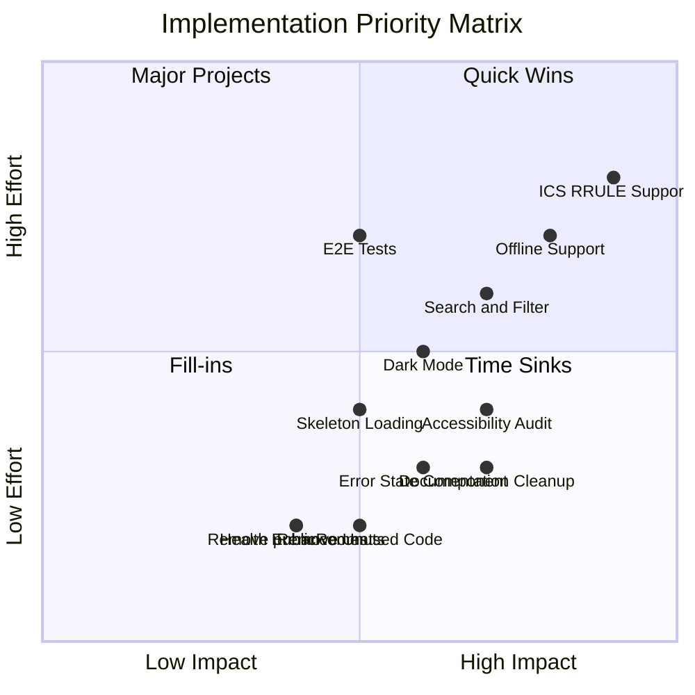
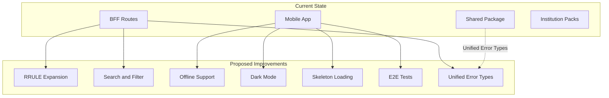

# Campus App Kit - Comprehensive Improvement Plan 2026

## Executive Summary

This plan provides a detailed roadmap for improving the Campus App Kit across all requested dimensions. Building on the existing improvement plan, this document adds specific implementation details, prioritization, and actionable tasks.

**Current State:**
- All 76 known bugs resolved and archived
- Core infrastructure stable with proper error handling, caching, and rate limiting
- UI components well-abstracted (ResourceListSection, ResourceDetailScreen, ResourceListItem)
- Documentation comprehensive but with some redundancy
- Known limitations: ICS RRULE support, MD5 for ETags in FIPS environments

---

## Phase 1: Repository Cleanup

### 1.1 Documentation Cleanup

#### 1.1.1 Remove/Archive Redundant Documentation

| File | Issue | Action |
|------|-------|--------|
| [`docs/OPEN_IMPROVEMENTS_AND_PLAN.md`](docs/OPEN_IMPROVEMENTS_AND_PLAN.md) | Superseded by plans in `/plans/` | Remove or reduce to redirect only |
| [`docs/expo-ota-code-signing.md`](docs/expo-ota-code-signing.md) | Only 450 chars, incomplete | Expand or remove |
| [`plans/phase1-implementation-checklist.md`](plans/phase1-implementation-checklist.md) | Phase 1 already completed | Archive or update status |

#### 1.1.2 Consolidate README and Runbook

**Current Issue:** Duplicate environment variable documentation between [`README.md`](README.md) and [`docs/runbook.md`](docs/runbook.md).

**Action:**
- Keep README concise with quick start only
- Runbook remains the single source for detailed configuration
- Add clear navigation between documents

### 1.2 Remove Unused Code and Exports

#### 1.2.1 Remove `packages/ui` Directory

**Location:** [`packages/ui/`](packages/ui/)

**Status:** Directory contains only empty `src/__tests__/` subdirectory. No package.json, no actual code.

**Action:**
- Verify no references to `@campus/ui` in codebase
- Remove entire `packages/ui/` directory
- Update [`pnpm-workspace.yaml`](pnpm-workspace.yaml) if needed

#### 1.2.2 Remove Redundant `publicRooms.ts`

**Location:** [`packages/shared/src/domain/publicRooms.ts`](packages/shared/src/domain/publicRooms.ts)

**Issue:** Only re-exports `RoomSchema` from [`public.ts`](packages/shared/src/domain/public.ts) with alias names.

**Action:**
- Search for imports of `PublicRoomSchema`, `PublicRoom`, `PublicRooms`
- Update imports to use `RoomSchema`, `Room` directly
- Delete `publicRooms.ts`
- Update [`packages/shared/src/index.ts`](packages/shared/src/index.ts)

#### 1.2.3 Remove Unused `CampusLabel` Type

**Location:** [`packages/shared/src/index.ts`](packages/shared/src/index.ts:1)

**Issue:** `CampusLabel` is exported but never used in the codebase.

**Action:**
- Search codebase for `CampusLabel` usage
- If unused, remove the export
- If used, document as public API

#### 1.2.4 Review `KnownInstitutionId` Export

**Location:** [`packages/institutions/src/packs.ts`](packages/institutions/src/packs.ts)

**Action:** Verify usage and either remove or document.

### 1.3 Clean Up Test Fixtures

**Location:** [`apps/bff/src/__fixtures__/`](apps/bff/src/__fixtures__/)

**Status:** All 8 fixture files are used by tests. No action needed.

---

## Phase 2: Code Deduplication

### 2.1 Hook Pattern Analysis

**Current State:** Five hooks with nearly identical patterns:
- [`useEvents.ts`](apps/mobile/src/hooks/useEvents.ts)
- [`useRooms.ts`](apps/mobile/src/hooks/useRooms.ts)
- [`useSchedule.ts`](apps/mobile/src/hooks/useSchedule.ts)
- [`useToday.ts`](apps/mobile/src/hooks/useToday.ts)
- [`usePublicResource.ts`](apps/mobile/src/hooks/usePublicResource.ts) - Base hook

**Assessment:** Already well-abstracted. Each hook is only 15 lines and provides type safety and clear API.

**Recommendation:** No deduplication needed. Current pattern is optimal.

### 2.2 Cache Implementation Analysis

**Current State:** Two separate cache implementations:
- [`apps/bff/src/utils/cache.ts`](apps/bff/src/utils/cache.ts) - Server-side
- [`apps/mobile/src/data/cache.ts`](apps/mobile/src/data/cache.ts) - Client-side

**Assessment:** Intentional separation with different requirements:

| Feature | BFF Cache | Mobile Cache |
|---------|-----------|--------------|
| Max entries | 1000 | 50 |
| In-flight limit | 500 | No hard limit |
| Cleanup | Periodic (60s) | On access |
| Timeout | 25s | 15s |
| Persistence | No | Could add |

**Recommendation:** Keep separate. Consider shared types for cache interface if needed.

### 2.3 Screen Component Pattern

**Current State:** Tab screens have similar patterns:
- [`index.tsx`](apps/mobile/app/(tabs)/index.tsx) - Today screen
- [`events.tsx`](apps/mobile/app/(tabs)/events.tsx)
- [`rooms.tsx`](apps/mobile/app/(tabs)/rooms.tsx)

**Assessment:** Already using [`ResourceListSection`](apps/mobile/src/ui/ResourceListSection.tsx) component. Callback patterns are similar but type-safe.

**Recommendation:** Consider creating resource-specific list components:

```typescript
// Proposed: apps/mobile/src/ui/EventListSection.tsx
export function EventListSection({ events, loading, error, ... }) {
  return (
    <ResourceListSection
      title="Events"
      items={events}
      keyExtractor={(e) => e.id}
      href={(e) => ({ pathname: "/events/[id]", params: { id: e.id } })}
      renderCard={(e) => ({ title: e.title, subtitle: new Date(e.date).toLocaleString() })}
      accessibilityLabel={(e) => `${e.title}. ${new Date(e.date).toLocaleString()}.`}
      // ...
    />
  );
}
```

---

## Phase 3: Code Refactoring

### 3.1 UI Component Filename Convention

**Current State:** Mixed naming in [`apps/mobile/src/ui/`](apps/mobile/src/ui/):
- PascalCase: `Card.tsx`, `Screen.tsx`, `Section.tsx`

**Recommendation:** Keep PascalCase for React components. This is the React convention.

### 3.2 Error Handling Standardization

**Current State:** Multiple error patterns:
- [`ApiErrorException`](apps/mobile/src/api/errors.ts) in mobile
- `sendError` utility in BFF
- Zod errors mapped to generic messages

**Proposed Improvement:** Create unified error type in `@campus/shared`:

```typescript
// Proposed: packages/shared/src/errors.ts
export type CampusError = {
  code: string;
  status: number;
  message: string;
  details?: Record<string, unknown>;
};

export const CampusErrorCodes = {
  VALIDATION_ERROR: "validation_error",
  NOT_FOUND: "not_found",
  NO_CONFIG: "no_config",
  UPSTREAM_ERROR: "upstream_error",
  RATE_LIMITED: "rate_limited",
} as const;
```

### 3.3 BFF Route Handler Enhancement

**Current State:** Routes use [`createJsonRoute`](apps/bff/src/routes/createJsonRoute.ts) factory.

**Potential Improvement:** Add OpenAPI schema generation for documentation.

### 3.4 Extract Common Date Formatting

**Current State:** Date formatting duplicated across screens:
```typescript
new Date(e.date).toLocaleString()
new Date(s.startsAt).toLocaleTimeString()
```

**Recommendation:** Create date formatting utilities:

```typescript
// Proposed: apps/mobile/src/utils/dateFormat.ts
export function formatEventDate(date: string): string {
  return new Date(date).toLocaleString();
}

export function formatScheduleTime(date: string): string {
  return new Date(date).toLocaleTimeString();
}
```

---

## Phase 4: Quality of Life Improvements

### 4.1 Developer Experience

| Improvement | Description | Priority |
|-------------|-------------|----------|
| One-command setup | `pnpm setup:dev` script | High |
| Environment validation | Better error messages for missing env | High |
| Hot reload for BFF | Add `tsx watch` for development | Medium |
| VS Code settings | Add recommended settings and extensions | Low |
| TypeScript paths | Verify all path aliases work correctly | Medium |

### 4.2 Health Endpoint Enhancement

**Current State:** [`/health`](apps/bff/src/routes/health.ts) returns basic `{ status: "ok" }`.

**Proposed Enhancement:**
```json
{
  "status": "ok",
  "version": "0.1.0",
  "institution": "hfmt",
  "uptime": 3600,
  "checks": {
    "institutionPack": "ok",
    "memory": "ok"
  }
}
```

### 4.3 Environment Configuration

**Action:** Ensure all `.env.example` files have:
- All available variables
- Short description for each
- Default values where applicable
- Link to documentation

---

## Phase 5: New Features

### 5.1 ICS RRULE Support (Priority: High)

**Current State:** Recurring events ignored (line 118-119 in [`icsParser.ts`](apps/bff/src/connectors/public/icsParser.ts)).

**Implementation Plan:**
1. Add `rrule` package dependency
2. Parse RRULE property in ICS parser
3. Expand recurring events to configurable horizon
4. Add configuration for expansion depth

**Code Location:** [`apps/bff/src/connectors/public/icsParser.ts`](apps/bff/src/connectors/public/icsParser.ts)

**Estimated Complexity:** Medium-High

### 5.2 Search/Filter Functionality

**Proposed Features:**
- Search events by title
- Filter schedule by date range
- Filter rooms by campus

**Implementation:**
1. Add query parameters to BFF endpoints
2. Implement server-side filtering
3. Add search UI in mobile app

**New Files Needed:**
- `apps/mobile/src/components/SearchBar.tsx`
- `apps/mobile/src/components/FilterPanel.tsx`

### 5.3 Offline Support

**Proposed Features:**
- Persist last successful response to AsyncStorage
- Show cached data when offline
- Add offline indicator in UI
- Queue refresh requests for when online

**Implementation:**
1. Enhance [`persistedCache.ts`](apps/mobile/src/data/persistedCache.ts)
2. Add network status detection
3. Add offline banner component

### 5.4 Deep Linking Enhancement

**Current State:** Expo Router supports deep linking by default.

**Enhancement:**
- Document deep link URLs
- Add QR codes for event sharing
- Support custom URL schemes

### 5.5 Push Notifications (Future)

**Note:** Requires private fork with authentication.

---

## Phase 6: UI Improvements

### 6.1 Loading States

**Current State:** [`LoadingBlock`](apps/mobile/src/ui/LoadingBlock.tsx) component exists but is basic.

**Enhancements:**
- Add skeleton loading for lists
- Add shimmer animation
- Consider `react-native-skeleton-placeholder`

**New Component:**
```typescript
// Proposed: apps/mobile/src/ui/SkeletonCard.tsx
export function SkeletonCard() {
  return (
    <View className="p-4 rounded-xl bg-surface animate-pulse">
      <View className="h-4 w-3/4 bg-muted rounded" />
      <View className="h-3 w-1/2 bg-muted rounded mt-2" />
    </View>
  );
}
```

### 6.2 Error States

**Current State:** Basic error text display.

**Enhancements:**
- Add retry button
- Add illustration for error states
- Differentiate network errors from server errors

**New Component:**
```typescript
// Proposed: apps/mobile/src/ui/ErrorState.tsx
export function ErrorState({ 
  message, 
  onRetry 
}: { 
  message: string; 
  onRetry?: () => void;
}) {
  return (
    <View className="items-center p-4">
      <Ionicons name="alert-circle" size={48} color={colors.accent} />
      <Text className="text-center mt-2">{message}</Text>
      {onRetry && (
        <Pressable onPress={onRetry} className="mt-4">
          <Text className="text-primary">Retry</Text>
        </Pressable>
      )}
    </View>
  );
}
```

### 6.3 Accessibility Audit

**Current State:** Basic accessibility labels implemented.

**Checklist:**
- [ ] Screen reader navigation order
- [ ] Focus management
- [ ] Color contrast ratios (WCAG AA)
- [ ] Font scaling support
- [ ] Reduce motion support

### 6.4 Dark Mode

**Current State:** Theme system exists in [`theme.ts`](apps/mobile/src/ui/theme.ts).

**Implementation:**
1. Add color scheme detection via `useColorScheme()`
2. Create dark theme colors
3. Add toggle in settings/profile screen
4. Persist preference to AsyncStorage

**Files to Modify:**
- [`apps/mobile/src/ui/theme.ts`](apps/mobile/src/ui/theme.ts)
- [`apps/mobile/app/(tabs)/profile.tsx`](apps/mobile/app/(tabs)/profile.tsx)

### 6.5 Animation Polish

**Current State:** Minimal animations.

**Enhancements:**
- Add list item entrance animations
- Add transition animations between screens
- Improve pull-to-refresh animation
- Use `react-native-reanimated` (already installed)

---

## Phase 7: Testing Improvements

### 7.1 BFF Integration Tests

**Current State:** [`server.integration.test.ts`](apps/bff/src/server.integration.test.ts) exists with basic tests.

**Enhancements:**
- Add test cases for all error scenarios
- Add performance tests for rate limiting
- Add mock server for external sources

### 7.2 Mobile Component Tests

**Current State:** Hook tests exist, UI component tests missing.

**Enhancements:**
- Add tests for `ResourceListSection`
- Add tests for `ResourceDetailScreen`
- Add tests for `Screen` component

### 7.3 E2E Tests

**Proposed:**
- Add Detox or Maestro for E2E testing
- Test critical user flows
- Add to CI pipeline

---

## Implementation Priority Matrix



---

## Recommended Implementation Order

### Sprint 1: Cleanup (Quick Wins)
1. Remove `packages/ui/` directory
2. Remove `publicRooms.ts` and update imports
3. Remove unused exports (`CampusLabel`, `KnownInstitutionId`)
4. Archive/update redundant documentation
5. Run full verification

### Sprint 2: QoL Improvements
1. Enhance health endpoint
2. Add one-command setup script
3. Improve .env.example files
4. Add hot reload for BFF
5. Create date formatting utilities

### Sprint 3: Feature Development
1. Implement ICS RRULE support
2. Add search/filter functionality
3. Implement offline support basics

### Sprint 4: UI Polish
1. Add skeleton loading components
2. Improve error states with retry
3. Conduct accessibility audit
4. Implement dark mode

### Sprint 5: Testing & Stability
1. Expand BFF integration tests
2. Add mobile component tests
3. Set up E2E testing infrastructure

---

## Architecture Diagram: Current vs Proposed



---

## Files Reference

| Category | Key Files |
|----------|-----------|
| BFF Server | [`apps/bff/src/server.ts`](apps/bff/src/server.ts) |
| BFF Routes | [`apps/bff/src/routes/`](apps/bff/src/routes/) |
| BFF Cache | [`apps/bff/src/utils/cache.ts`](apps/bff/src/utils/cache.ts) |
| BFF Connectors | [`apps/bff/src/connectors/public/`](apps/bff/src/connectors/public/) |
| ICS Parser | [`apps/bff/src/connectors/public/icsParser.ts`](apps/bff/src/connectors/public/icsParser.ts) |
| Mobile Data | [`apps/mobile/src/data/`](apps/mobile/src/data/) |
| Mobile Hooks | [`apps/mobile/src/hooks/`](apps/mobile/src/hooks/) |
| Mobile UI | [`apps/mobile/src/ui/`](apps/mobile/src/ui/) |
| Shared Schemas | [`packages/shared/src/domain/`](packages/shared/src/domain/) |
| Theme | [`apps/mobile/src/ui/theme.ts`](apps/mobile/src/ui/theme.ts) |
| Documentation | [`docs/`](docs/) |

---

## Questions for Clarification

Before proceeding with implementation, please clarify:

1. **Priority Focus:** Which area should be prioritized first?
   - Cleanup & Documentation
   - New Features (RRULE, Search)
   - UI Improvements (Dark Mode, Animations)
   - Testing Infrastructure

2. **RRULE Scope:** For recurring events, what expansion horizon is acceptable?
   - 3 months
   - 6 months
   - 1 year
   - Configurable per institution

3. **Offline Support Level:** What level of offline support is needed?
   - Basic (show cached data, no updates)
   - Medium (queue reads, show sync status)
   - Advanced (full offline-first with sync)

4. **Dark Mode:** Is dark mode a requirement or nice-to-have?

5. **Testing Scope:** What testing coverage target is acceptable?
   - Critical paths only
   - 70% coverage
   - 90%+ coverage

---

## Next Steps

1. Review this plan and provide feedback
2. Clarify priorities and scope
3. Switch to Code mode for implementation
4. Begin with Sprint 1 (Cleanup) tasks
